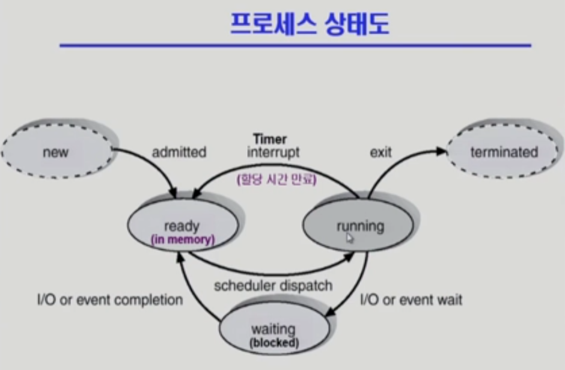
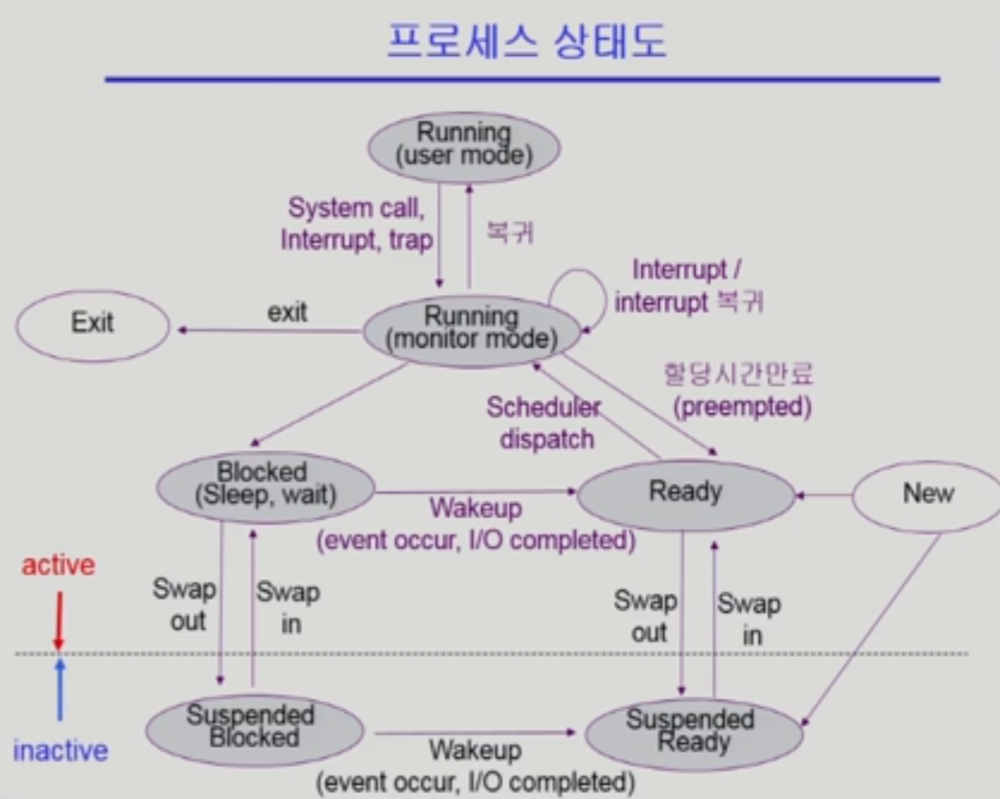
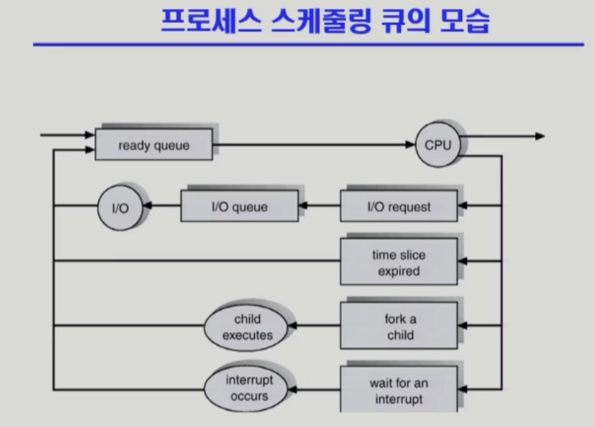

# 프로세스
## 프로세스의 개념
- Process is a program in execution
### 프로세스의 문맥(context)
- 문맥은 해당 프로세스가 현재 어떤 상태에 있는지 나타내는 의미로 사용된다.
- 해당 프로세스의 CPU 수행 상태를 나타내는 *하드웨어 문맥*
  - program counter
  - 각종 register
- 프로세스의 주소 공간
  - code, data, stack
- 프로세스 관련 커널 자료구조
  - PCB(Process Control Block)
  - Kernel stack

### 프로세스의 상태(Process State)
- Running: 
  - CPU에서 instruction을 수행 중인 상태
  - 프로세스가 kernel에 요청을 하거나(System call), interrupt되어 운영체제가 작업 중일때도 여전히 해당 프로세스가 (kernel mode에서) running 중이라고 표현한다
- Ready: 
  - CPU를 기다리는 상태(메모리 등 다른 조건을 모두 만족)
- Blocked(wait, sleep): 
  - CPU를 주어도 당장 instruction을 수행할 수 없는 상태
  - Process 자신이 요청한 event(예: I/O)가 즉시 만족되지 않아 이를 기다리는 상태
    - 공유데이터를 다른 프로세스가 사용 중이기 때문에 접근이 불가능한 경우 포함
  - 프로세스는 여전히 실행중이며, 자신이 요청한 event가 만족되면 ready
- New: 프로세스가 생성중인 상태
- Terminated: 수행(execution)이 끝난 상태

- Suspended(stopped): 
  - ***중기 스케줄러***에 의한 상태
  - 또는 다른 외부적인 이유로 프로세스의 수행이 정지된 상태
  - 프로세스는 통째로 디스크에 *swap out* 된다
  - 예시: 사용자가 프로그램을 일시 정지 시킨 경우(break key),
    - 메모리에 너무 많은 프로세스가 올라와 있는 경우 등
  - 프로세스는 실행 중이 *아니며*,  외부에서 resume 해주어야 active
  - 이전 상태에 따라 Suspended Blocked, 혹은 Suspended Ready
  - Suspended된 상태에서도 이전에(아직 blocked일 때) 보낸 I/O가 완료되거나 할 수 있다. 이경우 suspended blocked -> suspended ready로 상태변화

### Process Control Block (PCB)
- 운영체제가 각 프로세스를 관리하기 위해 프로세스당 유지하는 정보
- 다음의 구성 요소를 가진다(구조체로 유지, 커널 data에 존재)
  1. OS가 관리상 사용하는 정보
     - Process state, Process ID
     - scheduling information, priority
  2. CPU 수행 관련 하드웨어 값
     - Program counter, registers
  3. 메모리 관련
     - Code, data, stack의 위치 정보
  4. 파일 관련
     - open file descriptors 등

### 문맥 교환(Context Switch)
- CPU를 한 프로세스에서 다른 프로세스로 넘겨주는 과정
- CPU가 다른 프로세스에게 넘어갈 때 운영체제는 다음을 수행
  - CPU를 내어주는 프로세스의 상태를 그 프로세스의 PCB에 저장
  - CPU를 새롭게 얻는 프로세스의 상태를 PCB에서 읽어옴
- 따라서 PCB 내에 CPU 수행 관련 하드웨어값(pc, registers)을 저장해야 한다.
- process A -> interrupt -> kernel -> 문맥교환X -> process **A**
  - 문맥교환이 일어나지 않는 경우에도 일부 데이터(registers)를 PCB에 저장해야 하지만
- process B -> interrupt -> kernel -> 문맥교환O -> process **B**
  - 문맥교환이 일어나는 경우 그 부담이 크다(예시: cache memory flush)

### 프로세스를 스케줄링하기 위한 큐
- Job queue: 현재 시스템 내부에 있는 모든 프로세스의 집합
- Ready queue: 현재 메모리 내에 있으면서 CPU를 잡아서 실행되기를 기다리는 프로세스의 집합
- Device queues: I/O device의 처리를 기다리는 프로세스의 집합
- 프로세스들은 각 큐를 오가며 수행된다

- process -> ready_queue -> CPU -> I/O, time interrupt, fork, interrupt -> ready_queue

## 스케줄러(Scheduler)
- Long-term Scheduler(장기 스케줄러 or Job Scheduler)
  - 시작 프로세스 중 어떤 것들을 ***ready queue로*** 보낼지 결정
  - 프로세스에 ***memory***(및 각종 자원)을 주는 문제
  - ***degree of Multiprogramming***을 제어
    - 즉, 메모리에 올라가는 프로세스의 수를 제어
  - time sharing system에는 보통 장기 스케줄러가 없다(무조건 ready)
    - 해당 경우 중기 스케줄러를 통해 메모리 관리

- Short-term Scheduler(단기 스케줄러 or ***CPU Scheduler***)
  - 어떤 프로세스를 다음번에 ***running*** 시킬지 결정
  - 프로세스에 CPU를 주는 문제
  - 충분히 빨라야 할 필요(millisecond단위)

- Medium-term Scheduler(중기 스케줄러 or Swapper)
  - 여유 공간 마련을 위해 프로세스를 통째로 메모리에서 디스크로 쫓아냄
  - 프로세스에게서 ***memory***를 **뺏는** 문제
  - ***degree of Multiprogramming***을 제어

## Thread
- A thread is a basic unit of CPU utilization
- CPU의 수행 단위
- Thread의 구성
  - program counter
  - register set
  - stack space
- Thread가 동료 thread와 공유하는 부분(=task)
  - code section
  - data section
  - OS resources(files)
- 예시: 하나의 웹 브라우저에서 여러 탭을 사용하는 경우
  - 각 탭은 같은 코드를 사용하지만(하나의 process code section) 어떤 코드를 실행할지(program counter), 어떤 정보를 저장하는지(stack, register set) 등은 별개
- 이를 통해 context switch의 오버헤드를 줄일 수 있다.
### 장점
- Responsiveness:
  - 다중 스레드로 구성된 태스크 구조에서는 하나의 서버 스레드가 blocked(waiting) 상태인 동안에도 동일한 태스크 내의 다른 스레드가 실행(running)되어 빠른 처리 가능
- Resource Sharing & Economy:
  - 동일한 일을 수행하는 다중 스레드가 협력하여 높은 처리율(throughput)과 성능 향상
- Utilization of MP(Multiprocessor) Architectures:
  - 병렬성 향상

### 구현방법
- by Kernel
  - Kernel Threads
  - 운영체제 커널이 직접 지원
- by Library
  - User Threads
  - 프로세스 내부에서 thread를 이용