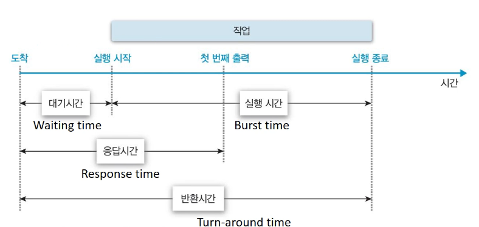

# CPU 스케줄링
- 프로세스의 성격에 따라 CPU-burst time(한번 할당에 cpu를 사용하는 시간)이 다르다
- I/O bound job
  - CPU를 사용하는 시간보다 I/O에 더 많은 시간이 필요한 job
  - Many short CPU bursts
  - 일반적으로 interactive process
- CPU bound job
  - 계산 위주의 job
  - few very long CPU bursts
- 일반적으로 I/O bound job에 CPU를 먼저 할당

## CPU Scheduler & Dispatcher
- CPU Scheduler
  - 운영체제 코드 중 Ready 상태의 프로세스 중에서 이번에 CPU를 줄 프로세스를 고르는 부분
- Dispatcher
  - CPU의 제어권을 CPU scheduler에 의해 선택된 프로세스에게 넘긴다
  - 이를 context switch(문맥 교환)이라고 한다
- CPU 스케줄링이 필요한 경우:
  - Running -> Blocked (I/O 요청하는 시스템 콜)
  - Running -> Ready (Time interrupt)
  - Blocked -> Ready (I/O 완료 후 interrupt)
  - Terminate
- Nonpreemptive: Running->Blocked, Terminate
- Preemptive: all other schedullings

## Scheduling Criteria(=Performance Index, 성능 척도)

1. CPU utilization(이용률)
  - keep the CPU as busy as possible
2. Throughtput(처리량)
  - number of process that complete their execution per time unit
3. times
- Turnaround time(소요시간, 반환시간)
  - amount of time to execute a particular process
  - 대기시간 + CPU 사용시간(burst)
- Waiting Time(대기 시간)
  - amount of time a process has been waiting in the ready queue
- Response time(응답 시간)
  - amount of time it takes from when a request was submitted until the first response is produced, not output
  - (for time-sharing environment)

## Scheduling Algorithms
### FCFS(First-come First-served)
- non-preemptive(빼앗지 않는 방법)
- 들어온 순서대로 처리
- convoy effect: short process behind long process
### SJF(Shortest-job-first)
- 각 프로세스의 다음번 CPU burst time을 가지고 스케줄링
- 가장 짧은 burst time 순서로 스케줄
  - Non-preemptive
    - 이번 CPU burst가 완료될 때 까지 CPU를 선점(preemption) 당하지 않음
  - Preemptive
    - 현재 수행중인 프로세스의 남은 burst time보다 더 짧은 CPU burst time을 가지는 새 프로세스가 도착하면 CPU를 빼앗김
    - Shortest-Remaining-Time-First(SRTF)와 동의
- SJF is ***optimal***
  - minimum average waiting time을 보장
- 단점
  - starvation: long process may never execute
  - CPU burst time 예측 문제
    - 추정(estimation)만이 가능
    - 과거의 CPU burst time을 이용(exponential averaging)
    - current estimation = last cpu burst time * alpha + last estimated burst time * (1 - alpha)
### Priority Scheduling
- A priority number(int) is associated with each process
- highest priority를 가진 프로세스에게 CPU 할당
  - smallest integer = highest priority
- SJF는 일종의 priority scheduling(예측한 다음 cpu burst time을 priority로 사용)
- starvation 발생 가능
  - ***Aging***으로 해결
  - as time progresses increase the priority of the process
### Round Robin(RR)
- 각 프로세스에 동일한 크기의 할당 시간(time quantum) 부여
  - 일반적으로 10 ~ 100 ms
- 할당 시간이 종료되면 프로세스는 선점당하고(preempted) ready queue의 가장 뒤로 이동
- n개의 프로세스가 ready queue에 있고, 할당 시간이 q time unit인 경우 어떤 프로세스도 (n-1)q time unit 이상 기다리지 않음
- 성능:
  - large q => FCFS
  - small q => increased context switch overhead
  - 일반적으로 SJF 보다 average turnaround time이 길지만, ***response time이 더 짧다***
  - interactive job이 많은 경우 큰 장점이 된다
  - CPU burst time이 long 과 short가 섞여있기 때문에 장점 발휘
    - 전부 비슷한 burst time을 가지는 경우 모든 프로세스가 느리게 종료되는 단점(= long avg turnaround time)
### Multi-level Queue
- ready queue를 여러 개로 분할
  - foreground(interactive) in RR
  - background(batch - no human interaction) in FCFS
- 큐에 대한 스케줄링이 필요
  - Fixed priority scheduling
    - serve all from foreground then from background
    - possibility of starvation
  - Time slice
    - split CPU time for each queues
    - eg: 80% to foreground, 20% to background
### Multi-level Feedback Queue
- 프로세스가 다른 큐로 이동 가능한 Multi-level queue
- ***aging***을 이와 같은 방식으로 구현 가능
- 아래와 같은 요소를 고려
  - queue의 수
  - 각 queue의 scheduling algorithm
  - process를 옮기는 기준
  - 프로세스가 어떤 queue로 들어갈지 결정하는 기준 
## Multiple-Processor Scheduling
- Homogeneous processor인 경우
  - queue에 한 줄로 세워 각 프로세서가 알아서 수행
  - 반드시 특정 프로세서에서 수행되어야 하는 프로세스가 있는 경우 복잡해진다
- Load Sharing
  - 일부 프로세서에 job이 몰리지 않도록 부하를 적절히 공유하는 메커니즘 필요
  - 별개의 큐를 두거나 공동 큐를 둘 수 있다
- Symmetric Multiprocessing(SMP)
  - 각 프로세서가 각자 알아서 스케줄링 결정
- Assymmetric Multiprocessing
  - 하나의 프로세서가 시스템 데이터의 접근과 공유를 책임지고 나머지 프로세서는 거기에 따름
## Real-Time Scheduling
- Hard real-time systems
  - hard real-time task는 정해진 시간 안에 반드시 끝내도록 스케줄링
- Soft real-time systems
  - soft real-time task에는 일반 프로세스에 비해 높은 priority를 부여
  - 예시: 동영상 재생
## Thread Scheduling
- Local Scheduling
  - 운영체제가 thread의 존재를 모르는 경우
  - User level thread의 경우 사용자 수준의 thread library에 의해 어떤 thread를 스케줄할지 결정
- Global Scheduling
  - 운영체제가 thread의 존재를 아는 경우
  - Kernel level thread의 경우 일반 프로세스와 마찬가지로 커널 단기 스케줄러가 어떤 thread를 스케줄할지 결정

## Algorithm Evaluation
- Queueing models
  - 이론적 분석
  - 확률 분포로 주어지는 arrival rate와 service rate 등을 통해 각종 performance index 값을 계산
- Implementation(구현) & Measurement(성능측정)
  - 실제 시스템에 알고리즘을 구현하여 실제 작업(workload)에 대해서 성능을 측정 비교
  - 실제 소스코드를 수정해야 하기 때문에 어려움
- Simulation(모의실험)
  - 알고리즘을 모의 프로그램으로 작성 후 trace를 입력으로 하여 결과 비교
  - trace: 모의 입력, 실제 사용 환경에서의 입력을 복사하여 사용 or 제작하여 사용